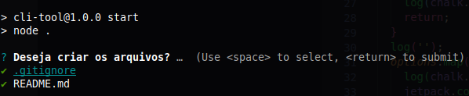

# Cli tool

Cli para gerar os arquivos de gitignore e readme

### Tecnologias utilizadas no projeto;

- NodeJs [Site](https://nodejs.org/en/)
- Enquirer [Github](https://github.com/enquirer/enquirer)
- Chalk [Github](https://github.com/chalk/chalk)
- Fs-jetpack [Github](https://github.com/szwacz/fs-jetpack)

### Start do projeto

```shell
npm install && npm start

```

### Imagen cli tool


